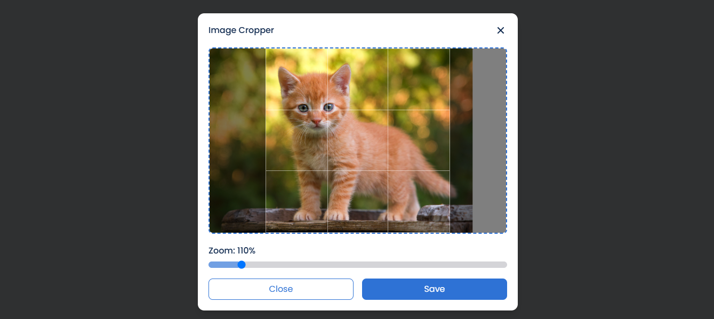

# Image Cropper

## <a name="preview">📸 Preview</a>
  
<br>

## 🎯 Live Demo  
🔗 **[Check out the live demo here](https://image-cropper-topaz.vercel.app/)**  

## <a name="tools">🛠️ Tools</a>

-   [React JS](https://react.dev)
-   [TailwindCSS](https://tailwindcss.com/)
-   [Framer Motion](https://www.npmjs.com/package/framer-motion)
-   [React Easy Crop](https://www.npmjs.com/package/react-easy-crop)
-   [React Icons](https://react-icons.github.io/react-icons/)

## <a name="features">✨ Features</a>

-  Drag And Drop File
-  Crop Image
-  Download Image


## <a name="getting-started">🚀 Getting Started</a>

To get started follow these steps:

#### Cloning the Repository

Using CLI

```bash
git clone https://github.com/smRid/Image-Cropper.git
```

**\*\*_Ensure you have installed [Git](https://git-scm.com) on your machine._**

or using GitHub:

-   Go to the project [repository](https://github.com/smRid/Image-Cropper.git) on my GitHub page
-   Click on the green button on the top 👆
-   Click Download ZIP

#### Installation

Install the project dependencies using npm:

```bash
npm install
```

**\*\*_Ensure you have installed [NodeJS](https://nodejs.org/en) on your machine._**

#### Running the Project

```bash
npm run dev
```

**\*\*_This project uses [Vite](https://vitejs.dev)._**
